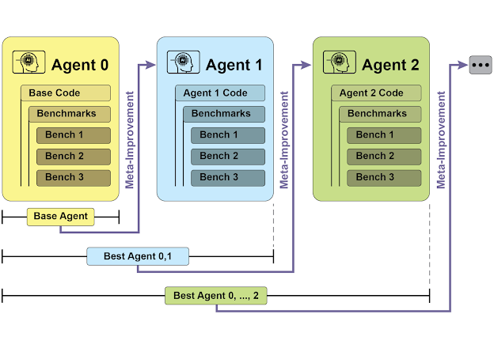
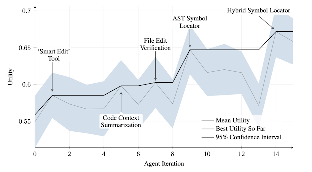
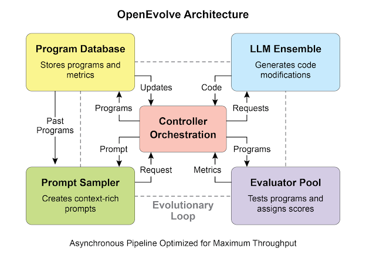
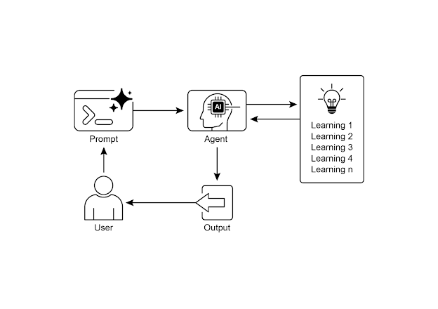

# Chapter 9: Learning and Adaptation

Learning and adaptation are pivotal for enhancing the capabilities of artificial intelligence agents. These processes enable agents to evolve beyond predefined parameters, allowing them to improve autonomously through experience and environmental interaction. By learning and adapting, agents can effectively manage novel situations and optimize their performance without constant manual intervention. This chapter explores the principles and mechanisms underpinning agent learning and adaptation in detail.

## Learning and Adaptation: The Big Picture

Agents learn and adapt by changing their thinking, actions, or knowledge based on new experiences and data. This allows agents to evolve from simply following instructions to becoming smarter over time.

- **Reinforcement Learning:** Agents try actions and receive rewards for positive outcomes and penalties for negative ones, learning optimal behaviors in changing situations. Useful for agents controlling robots or playing games.
- **Supervised Learning:** Agents learn from labeled examples, connecting inputs to desired outputs, enabling tasks like decision-making and pattern recognition. Ideal for agents sorting emails or predicting trends.
- **Unsupervised Learning:** Agents discover hidden connections and patterns in unlabeled data, aiding in insights, organization, and creating a mental map of their environment. Useful for agents exploring data without specific guidance.
- **Few-Shot/Zero-Shot Learning with LLM-Based Agents:** Agents leveraging LLMs can quickly adapt to new tasks with minimal examples or clear instructions, enabling rapid responses to new commands or situations.
- **Online Learning:** Agents continuously update knowledge with new data, essential for real-time reactions and ongoing adaptation in dynamic environments. Critical for agents processing continuous data streams.
- **Memory-Based Learning:** Agents recall past experiences to adjust current actions in similar situations, enhancing context awareness and decision-making. Effective for agents with memory recall capabilities.

Adaptation is the agent's change in strategy, understanding, or goals based on what it has learned. This learning and adaptation are crucial for building agents that excel in unpredictable, changing, or new environments.

Learning algorithms like **Proximal Policy Optimization (PPO)** are used for continuous control problems. PPO balances sample efficiency with ease of implementation, training agents over time to learn optimal actions. The implementation involves setting up a virtual environment, training the agent with PPO, and then evaluating performance.

PPO operates by collecting a batch of experiences from the current policy, then optimizing a surrogate objective function that tries to improve the policy without deviating too far from the old one. This constraint on policy updates is crucial for stable learning, preventing the agent from making drastic changes that could undo previous progress. It uses a clipped objective to limit the update size, ensuring that the new policy stays close to the old policy, while still aiming to improve performance based on collected data. This clipping mechanism helps in balancing exploration with exploitation, allowing the agent to try new strategies while maintaining stability and convergence.

**Direct Preference Optimization (DPO)** offers a distinct approach to aligning language models compared to Proximal Policy Optimization (PPO).

PPO typically involves training a reward model using human feedback, then optimizing the language model's policy to maximize this reward. This two-step process can be complex and potentially unstable. DPO, conversely, streamlines this process by directly optimizing the language model based on preference data, such as comparing two model responses and indicating which is preferred.

Instead of learning an explicit reward model, DPO implicitly learns a reward function from the preference data. This direct optimization avoids the need for a separate reward model, making the process simpler and potentially more stable. By eliminating the intermediate reward modeling step, DPO reduces the chance of reward hacking and misalignment, leading to more reliable and efficient training of language models.

In essence, DPO simplifies the alignment process by directly mapping preference data to policy updates, offering a more straightforward and robust alternative to PPO for aligning language models.

## Practical Applications & Use Cases

Adaptive agents exhibit enhanced performance in variable environments through iterative updates driven by experiential data.

- **Personalized assistant agents** refine interaction protocols through longitudinal analysis of individual user behaviors, ensuring highly optimized response generation.
- **Trading bot agents** optimize decision-making algorithms by dynamically adjusting model parameters based on high-resolution, real-time market data, thereby maximizing financial returns and mitigating risk factors.
- **Application agents** optimize user interface and functionality through dynamic modification based on observed user behavior, resulting in increased user engagement and system intuitiveness.
- **Robotic and autonomous vehicle agents** enhance navigation and response capabilities by integrating sensor data and historical action analysis, enabling safe and efficient operation across diverse environmental conditions.
- **Fraud detection agents** improve anomaly detection by refining predictive models with newly identified fraudulent patterns, enhancing system security and minimizing financial losses.
- **Recommendation agents** improve content selection precision by employing user preference learning algorithms, providing highly individualized and contextually relevant recommendations.
- **Game AI agents** enhance player engagement by dynamically adapting strategic algorithms, thereby increasing game complexity and challenge.
- **Knowledge Base Learning Agents:** Agents can leverage Retrieval Augmented Generation (RAG) to maintain a dynamic knowledge base of problem descriptions and proven solutions. By storing successful strategies and challenges encountered, the agent can reference this data during decision-making, enabling it to adapt to new situations more effectively by applying previously successful patterns or avoiding known pitfalls.

## Case Study: The Self-Improving Coding Agent (SICA)

The Self-Improving Coding Agent (SICA), developed by Maxime Robeyns, Laurence Aitchison, and Martin Szummer, represents an advancement in agent-based learning, demonstrating the capacity for an agent to modify its own source code. This contrasts with traditional approaches where one agent might train another; SICA acts as both the modifier and the modified entity, iteratively refining its code base to improve performance across various coding challenges.

SICA's self-improvement operates through an iterative cycle (see Fig.1). Initially, SICA reviews an archive of its past versions and their performance on benchmark tests. It selects the version with the highest performance score, calculated based on a weighted formula considering success, time, and computational cost. This selected version then undertakes the next round of self-modification. It analyzes the archive to identify potential improvements and then directly alters its codebase. The modified agent is subsequently tested against benchmarks, with the results recorded in the archive. This process repeats, facilitating learning directly from past performance. This self-improvement mechanism allows SICA to evolve its capabilities without requiring traditional training paradigms.


_Fig.1: SICA's self-improvement, learning and adapting based on its past versions_

SICA underwent significant self-improvement, leading to advancements in code editing and navigation. Initially, SICA utilized a basic file-overwriting approach for code changes. It subsequently developed a "Smart Editor" capable of more intelligent and contextual edits. This evolved into a "Diff-Enhanced Smart Editor," incorporating diffs for targeted modifications and pattern-based editing, and a "Quick Overwrite Tool" to reduce processing demands. SICA further implemented "Minimal Diff Output Optimization" and "Context-Sensitive Diff Minimization," using Abstract Syntax Tree (AST) parsing for efficiency. Additionally, a "SmartEditor Input Normalizer" was added. In terms of navigation, SICA independently created an "AST Symbol Locator," using the code's structural map (AST) to identify definitions within the codebase. Later, a "Hybrid Symbol Locator" was developed, combining a quick search with AST checking. This was further optimized via "Optimized AST Parsing in Hybrid Symbol Locator" to focus on relevant code sections, improving search speed.(see Fig. 2)


_Fig.2 : Performance across iterations. Key improvements are annotated with their corresponding tool or agent modifications. (courtesy of Maxime Robeyns , Martin Szummer , Laurence Aitchison)_

SICA's architecture comprises a foundational toolkit for basic file operations, command execution, and arithmetic calculations. It includes mechanisms for result submission and the invocation of specialized sub-agents (coding, problem-solving, and reasoning). These sub-agents decompose complex tasks and manage the LLM's context length, especially during extended improvement cycles. An asynchronous overseer, another LLM, monitors SICA's behavior, identifying potential issues such as loops or stagnation. It communicates with SICA and can intervene to halt execution if necessary. The overseer receives a detailed report of SICA's actions, including a callgraph and a log of messages and tool actions, to identify patterns and inefficiencies.

SICA's LLM organizes information within its context window, its short-term memory, in a structured manner crucial to its operation. This structure includes a System Prompt defining agent goals, tool and sub-agent documentation, and system instructions. A Core Prompt contains the problem statement or instruction, content of open files, and a directory map. Assistant Messages record the agent's step-by-step reasoning, tool and sub-agent call records and results, and overseer communications. This organization facilitates efficient information flow, enhancing LLM operation and reducing processing time and costs. Initially, file changes were recorded as diffs, showing only modifications and periodically consolidated.

### SICA: A Look at the Code

Delving deeper into SICA's implementation reveals several key design choices that underpin its capabilities. The system is built with a modular architecture, incorporating several sub-agents, such as a coding agent, a problem-solver agent, and a reasoning agent. These sub-agents are invoked by the main agent, much like tool calls, serving to decompose complex tasks and efficiently manage context length, especially during those extended meta-improvement iterations.

For security, the project strongly emphasizes Docker containerization, meaning the agent runs within a dedicated Docker container. This is a crucial measure, as it provides isolation from the host machine, mitigating risks like inadvertent file system manipulation given the agent's ability to execute shell commands.

To ensure transparency and control, the system features robust observability through an interactive webpage that visualizes events on the event bus and the agent's callgraph. This offers comprehensive insights into the agent's actions, allowing users to inspect individual events, read overseer messages, and collapse sub-agent traces for clearer understanding.

In terms of its core intelligence, the agent framework supports LLM integration from various providers, enabling experimentation with different models to find the best fit for specific tasks. Finally, a critical component is the asynchronous overseer, an LLM that runs concurrently with the main agent. This overseer periodically assesses the agent's behavior for pathological deviations or stagnation and can intervene by sending notifications or even cancelling the agent's execution if necessary. It receives a detailed textual representation of the system's state, including a callgraph and an event stream of LLM messages, tool calls, and responses, which allows it to detect inefficient patterns or repeated work.

The project is actively developed and aims to provide a robust framework for those interested in post-training LLMs on tool use and other agentic tasks, with the full code available for further exploration and contribution at the [https://github.com/MaximeRobeyns/self_improving_coding_agent/](https://github.com/MaximeRobeyns/self_improving_coding_agent/) GitHub repository.

The authors identified a significant challenge in their initial implementation of SICA: prompting the LLM-based agent to independently propose genuinely novel, innovative, feasible, and engaging modifications during each meta-improvement iteration. This limitation, specifically concerning fostering open-ended learning and authentic creativity in LLM agents, remains a prominent area of investigation in contemporary research.

## AlphaEvolve

AlphaEvolve is an AI agent developed by Google designed to discover and optimize algorithms. It utilizes a combination of LLMs, specifically Gemini models (Flash and Pro), automated evaluation systems, and an evolutionary algorithm framework. This system aims to advance both theoretical mathematics and practical computing applications.

AlphaEvolve employs an ensemble of Gemini models. Flash is used for generating a wide range of initial algorithm proposals, while Pro provides more in-depth analysis and refinement. Proposed algorithms are then automatically evaluated and scored based on predefined criteria. This evaluation provides feedback that is used to iteratively improve the solutions, leading to optimized and novel algorithms.

In practical computing, AlphaEvolve has been deployed within Google's infrastructure. It has demonstrated improvements in data center scheduling, resulting in a 0.7% reduction in global compute resource usage. It has also contributed to hardware design by suggesting optimizations for Verilog code in upcoming Tensor Processing Units (TPUs). Furthermore, AlphaEvolve has accelerated AI performance, including a 23% speed improvement in a core kernel of the Gemini architecture and up to 32.5% optimization of low-level GPU instructions for FlashAttention.

In the realm of fundamental research, AlphaEvolve has contributed to the discovery of new algorithms for matrix multiplication, including a method for 4x4 complex-valued matrices that uses 48 scalar multiplications, surpassing previously known solutions. In broader mathematical research, it has rediscovered existing state-of-the-art solutions to over 50 open problems in 75% of cases and improved upon existing solutions in 20% of cases, with examples including advancements in the kissing number problem.

## OpenEvolve

OpenEvolve is an evolutionary coding agent that leverages LLMs (see Fig.3) to iteratively optimize code. It orchestrates a pipeline of LLM-driven code generation, evaluation, and selection to continuously enhance programs for a wide range of tasks. A key aspect of OpenEvolve is its capability to evolve entire code files, rather than being limited to single functions. The agent is designed for versatility, offering support for multiple programming languages and compatibility with OpenAI-compatible APIs for any Large Language Model. Furthermore, it incorporates multi-objective optimization, allows for flexible prompt engineering, and is capable of distributed evaluation to efficiently handle complex coding challenges.

```python
from openevolve import OpenEvolve

# Initialize the system
evolve = OpenEvolve(
    initial_program_path="path/to/initial_program.py",
    evaluation_file="path/to/evaluator.py",
    config_path="path/to/config.yaml"
)

# Run the evolution
best_program = await evolve.run(iterations=1000)

print(f"Best program metrics:")
for name, value in best_program.metrics.items():
    print(f" {name}: {value:.4f}")
```

This code snippet uses the `OpenEvolve` library to perform evolutionary optimization on a program. It initializes the `OpenEvolve` system with paths to an initial program, an evaluation file, and a configuration file. The `evolve.run(iterations=1000)` line starts the evolutionary process, running for 1000 iterations to find an improved version of the program. Finally, it prints the metrics of the best program found during the evolution, formatted to four decimal places.


_Fig. 3: OpenEvolve Internal Architecture. A controller orchestrates the program sampler, Program Database, Evaluator Pool, and LLM Ensembles, facilitating their learning and adaptation to improve code._

## At a Glance

**What:** AI agents often operate in dynamic and unpredictable environments where pre-programmed logic is insufficient. Their performance can degrade when faced with novel situations not anticipated during their initial design. Without the ability to learn from experience, agents cannot optimize their strategies or personalize their interactions over time. This rigidity limits their effectiveness and prevents them from achieving true autonomy in complex, real-world scenarios.

**Why:** The standardized solution is to integrate learning and adaptation mechanisms, transforming static agents into dynamic, evolving systems. This allows an agent to autonomously refine its knowledge and behaviors based on new data and interactions. Agentic systems can use various methods, from reinforcement learning to more advanced techniques like self-modification, as seen in the Self-Improving Coding Agent (SICA). Advanced systems like Google's AlphaEvolve leverage LLMs and evolutionary algorithms to discover entirely new and more efficient solutions to complex problems. By continuously learning, agents can master new tasks, enhance their performance, and adapt to changing conditions without requiring constant manual reprogramming.

**Rule of thumb:** Use this pattern when building agents that must operate in dynamic, uncertain, or evolving environments. It is essential for applications requiring personalization, continuous performance improvement, and the ability to handle novel situations autonomously.

**Visual summary**


_Learning and adapting pattern_

## Key Takeaways

- Learning and Adaptation are about agents getting better at what they do and handling new situations by using their experiences.
- "Adaptation" is the visible change in an agent's behavior or knowledge that comes from learning.
- SICA, the Self-Improving Coding Agent, is a fantastic real-world example. It learns by actually changing its own code, using a smart loop that looks at past performance.
- SICA's self-improvement led to cool tools for editing code (like the Smart Editor) and navigating code (like the AST Symbol Locator).
- Having specialized "sub-agents" and an "overseer" helps these self-improving systems manage big tasks and stay on track.
- The way an LLM's "context window" is set up (with system prompts, core prompts, and assistant messages) is super important for how efficiently agents work.
- This pattern is vital for agents that need to operate in environments that are always changing, uncertain, or require a personal touch.
- Building agents that learn often means hooking them up with machine learning tools and managing how data flows.
- An agent system, equipped with basic coding tools, can autonomously edit itself, and thereby improve its performance on benchmark tasks
- AlphaEvolve is Google's AI agent that leverages LLMs and an evolutionary framework to autonomously discover and optimize algorithms, significantly enhancing both fundamental research and practical computing applications..

## Conclusion

This chapter explores the critical functions of learning and adaptation in Artificial Intelligence. AI agents can improve their performance through ongoing data acquisition and experience. The Self-Improving Coding Agent (SICA) demonstrates this by autonomously enhancing its capabilities via code adjustments.

The basic components of agentic AI, including architecture, applications, planning, multi-agent collaboration, memory management, and learning and adaptation, have been reviewed. In multi-agent systems, these learning principles are especially critical for coordinated improvement. To achieve this, it is essential that the tuning data reflects the entire interaction trajectory, a a capturing the individual inputs and outputs of every participating agent. These elements contribute to notable progress, as seen in Google's AlphaEvolve. This AI system independently discovers and refines algorithms by combining LLMs, automated assessment, and an evolutionary approach, fostering progress in scientific research and computational techniques. These patterns can be combined to build complex AI systems. Developments like AlphaEvolve illustrate that autonomous algorithmic discovery and optimization by AI agents is achievable.

## References

- Sutton, R. S., & Barto, A. G. (2018). _Reinforcement Learning: An Introduction_. MIT Press.
- Goodfellow, I., Bengio, Y., & Courville, A. (2016). _Deep Learning_. MIT Press.
- Mitchell, T. M. (1997). _Machine Learning_. McGraw-Hill.
- Proximal Policy Optimization Algorithms by John Schulman, Filip Wolski, Prafulla Dhariwal, Alec Radford, and Oleg Klimov. You can find it on arXiv: [https://arxiv.org/abs/1707.06347](https://arxiv.org/abs/1707.06347)
- Robeyns, M., Aitchison, L., & Szummer, M. (2025). A Self-Improving Coding Agent. arXiv:2504.15228v2. [https://arxiv.org/pdf/2504.15228](https://arxiv.org/pdf/2504.15228) [https://github.com/MaximeRobeyns/self_improving_coding_agent](https://github.com/MaximeRobeyns/self_improving_coding_agent)
- AlphaEvolve blog, [https://deepmind.google/discover/blog/alphaevolve-a-gemini-powered-coding-agent-for-designing-advanced-algorithms/](https://deepmind.google/discover/blog/alphaevolve-a-gemini-powered-coding-agent-for-designing-advanced-algorithms/)
- OpenEvolve, [https://github.com/codelion/openevolve](https://github.com/codelion/openevolve)
