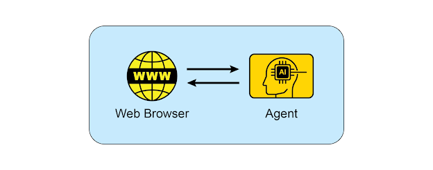

# Appendix B: AI Agentic Interactions: From GUI to Real World environment

AI agents are increasingly performing complex tasks by interacting with digital interfaces and the physical world. Their ability to perceive, process, and act within these varied environments is fundamentally transforming automation, human-computer interaction, and intelligent systems. This appendix explores how agents interact with computers and their environments, highlighting advancements and projects.

## Interaction: Agents with Computers

The evolution of AI from conversational partners to active, task-oriented agents is being driven by **Agent-Computer Interfaces (ACIs)**. These interfaces allow AI to interact directly with a computer's Graphical User Interface (GUI), enabling it to perceive and manipulate visual elements like icons and buttons just as a human would. This new method moves beyond the rigid, developer-dependent scripts of traditional automation that relied on APIs and system calls. By using the visual "front door" of software, AI can now automate complex digital tasks in a more flexible and powerful way, a process that involves several key stages:

- **Visual Perception:** The agent first captures a visual representation of the screen, essentially taking a screenshot.
- **GUI Element Recognition:** It then analyzes this image to distinguish between various GUI elements. It must learn to "see" the screen not as a mere collection of pixels, but as a structured layout with interactive components, discerning a clickable "Submit" button from a static banner image or an editable text field from a simple label.
- **Contextual Interpretation:** The ACI module, acting as a bridge between the visual data and the agent's core intelligence (often a Large Language Model or LLM), interprets these elements within the context of the task. It understands that a magnifying glass icon typically means "search" or that a series of radio buttons represents a choice. This module is crucial for enhancing the LLM's reasoning, allowing it to form a plan based on visual evidence.
- **Dynamic Action and Response:** The agent then programmatically controls the mouse and keyboard to execute its plan—clicking, typing, scrolling, and dragging. Critically, it must constantly monitor the screen for visual feedback, dynamically responding to changes, loading screens, pop-up notifications, or errors to successfully navigate multi-step workflows.

This technology is no longer theoretical. Several leading AI labs have developed functional agents that demonstrate the power of GUI interaction:

- **ChatGPT Operator (OpenAI):** Envisioned as a digital partner, ChatGPT Operator is designed to automate tasks across a wide range of applications directly from the desktop. It understands on-screen elements, enabling it to perform actions like transferring data from a spreadsheet into a customer relationship management (CRM) platform, booking a complex travel itinerary across airline and hotel websites, or filling out detailed online forms without needing specialized API access for each service. This makes it a universally adaptable tool aimed at boosting both personal and enterprise productivity by taking over repetitive digital chores.
- **Google Project Mariner:** As a research prototype, Project Mariner operates as an agent within the Chrome browser. Its purpose is to understand a user's intent and autonomously carry out web-based tasks on their behalf. For example, a user could ask it to find three apartments for rent within a specific budget and neighborhood; Mariner would then navigate to real estate websites, apply the filters, browse the listings, and extract the relevant information into a document. This project represents Google's exploration into creating a truly helpful and "agentive" web experience where the browser actively works for the user.

_Fig.1: Interaction between and Agent and the Web Browser_

- **Anthropic's Computer Use:** This feature empowers Anthropic's AI model, Claude, to become a direct user of a computer's desktop environment. By capturing screenshots to perceive the screen and programmatically controlling the mouse and keyboard, Claude can orchestrate workflows that span multiple, unconnected applications. A user could ask it to analyze data in a PDF report, open a spreadsheet application to perform calculations on that data, generate a chart, and then paste that chart into an email draft—a sequence of tasks that previously required constant human input.

## Interaction: Agents with the Environment

Beyond the confines of a computer screen, AI agents are increasingly designed to interact with complex, dynamic environments, often mirroring the real world. This requires sophisticated perception, reasoning, and actuation capabilities.

- **Google's Project Astra** is a prime example of an initiative pushing the boundaries of agent interaction with the environment. Astra aims to create a universal AI agent that is helpful in everyday life, leveraging multimodal inputs (sight, sound, voice) and outputs to understand and interact with the world contextually. This project focuses on rapid understanding, reasoning, and response, allowing the agent to "see" and "hear" its surroundings through cameras and microphones and engage in natural conversation while providing real-time assistance. Astra's vision is an agent that can seamlessly assist users with tasks ranging from finding lost items to debugging code, by understanding the environment it observes. This moves beyond simple voice commands to a truly embodied understanding of the user's immediate physical context.
- **Google's Gemini Live,** transforms standard AI interactions into a fluid and dynamic conversation. Users can speak to the AI and receive responses in a natural-sounding voice with minimal delay, and can even interrupt or change topics mid-sentence, prompting the AI to adapt immediately. The interface expands beyond voice, allowing users to incorporate visual information by using their phone's camera, sharing their screen, or uploading files for a more context-aware discussion. More advanced versions can even perceive a user's tone of voice and intelligently filter out irrelevant background noise to better understand the conversation. These capabilities combine to create rich interactions, such as receiving live instructions on a task by simply pointing a camera at it.
- **OpenAI's GPT-4o model** is an alternative designed for "omni" interaction, meaning it can reason across voice, vision, and text. It processes these inputs with low latency that mirrors human response times, which allows for real-time conversations. For example, users can show the AI a live video feed to ask questions about what is happening, or use it for language translation. OpenAI provides developers with a "Realtime API" to build applications requiring low-latency, speech-to-speech interactions.
- **Anthropic's Claude 4 Series** Anthropic's Claude 4 is another alternative with capabilities for advanced reasoning and analysis. Though historically focused on text, Claude 4 includes robust vision capabilities, allowing it to process information from images, charts, and documents. The model is suited for handling complex, multi-step tasks and providing detailed analysis. While the real-time conversational aspect is not its primary focus compared to other models, its underlying intelligence is designed for building highly capable AI agents.

## Conclusion

AI agents have evolved from backend automation to mastering digital environments by learning to interact with graphical user interfaces just as humans do. Building on this foundation, the next frontier for these agents is the physical world, where they are now beginning to see, hear, and understand their immediate surroundings in real-time. Leading projects from Google, OpenAI, and others are converging these capabilities, creating a new class of universal assistants that can seamlessly shift from performing a task on a computer to providing context-aware help in the real world. This integration of digital control and environmental perception is paving the way for truly helpful, context-aware AI companions that can assist with nearly any aspect of our daily lives.

## Key takeaways

- AI agents are evolving from simple automation to visually controlling software through graphical user interfaces, much like a human would.
- The next frontier is real-world interaction, with projects like Google's Astra using cameras and microphones to see, hear, and understand their physical surroundings.
- Leading technology companies are converging these digital and physical capabilities to create universal AI assistants that operate seamlessly across both domains.
- This shift is creating a new class of proactive, context-aware AI companions capable of assisting with a vast range of tasks in users' daily lives.

## References

- [Open AI Operator](https://openai.com/index/introducing-operator/)
- [Project Mariner](https://deepmind.google/models/project-mariner/)
- [Anthropic Computer use](https://docs.anthropic.com/en/docs/build-with-claude/computer-use)
- [Project Astra](https://deepmind.google/models/project-astra/)
- [Gemini Live](https://gemini.google/overview/gemini-live/?hl=en)
- [OpenAI's GPT-4](https://openai.com/index/gpt-4-research/)
- [Claude 4](https://www.anthropic.com/news/claude-4)
